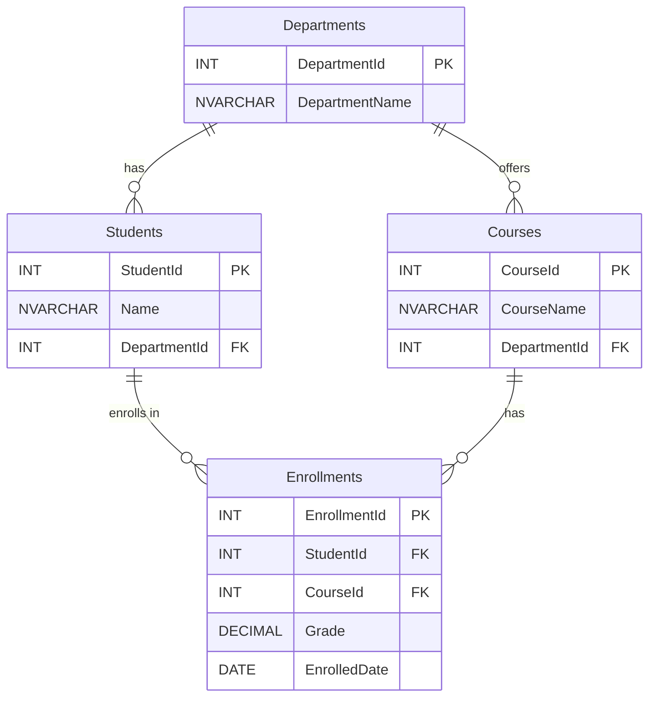

# Schema-Based Queries

This file presents a single database schema and asks progressively harder SQL questions against it — a classic interview format. The schema models a university system and is simple enough to fit on a whiteboard, but rich enough to test joins, aggregation, window functions, relational division, indexing strategy, and concurrency.

## Schema



```sql
CREATE TABLE Departments (
    DepartmentId INT PRIMARY KEY,
    DepartmentName NVARCHAR(100)
);

CREATE TABLE Students (
    StudentId INT PRIMARY KEY,
    Name NVARCHAR(100),
    DepartmentId INT FOREIGN KEY REFERENCES Departments(DepartmentId)
);

CREATE TABLE Courses (
    CourseId INT PRIMARY KEY,
    CourseName NVARCHAR(100),
    DepartmentId INT FOREIGN KEY REFERENCES Departments(DepartmentId)
);

CREATE TABLE Enrollments (
    EnrollmentId INT PRIMARY KEY,
    StudentId INT FOREIGN KEY REFERENCES Students(StudentId),
    CourseId INT FOREIGN KEY REFERENCES Courses(CourseId),
    Grade DECIMAL(4,2),
    EnrolledDate DATE
);
```

**Relationships:** A student belongs to one department. A course belongs to one department. A student enrolls in courses through the `Enrollments` table. A student can enroll in courses from any department, not just their own.

---

### 1. 🟢 Using the schema above, write a query to get the second highest grade across all enrollments.

The classic "Nth highest" question. Use `OFFSET…FETCH`, `DENSE_RANK()`, or a subquery approach:

```sql
-- Approach 1: OFFSET / FETCH (SQL Server 2012+)
SELECT MAX(Grade) AS SecondHighestGrade
FROM Enrollments
WHERE Grade < (SELECT MAX(Grade) FROM Enrollments);

-- Approach 2: DENSE_RANK window function
SELECT Grade AS SecondHighestGrade
FROM (
    SELECT Grade, DENSE_RANK() OVER (ORDER BY Grade DESC) AS rn
    FROM Enrollments
) ranked
WHERE rn = 2;

-- Approach 3: OFFSET / FETCH (clean, generalises to Nth)
SELECT DISTINCT Grade AS SecondHighestGrade
FROM Enrollments
ORDER BY Grade DESC
OFFSET 1 ROW FETCH NEXT 1 ROW ONLY;
```

`DENSE_RANK` handles ties correctly — if two students share the highest grade, the next distinct grade is still rank 2. `ROW_NUMBER` would skip it. The subquery approach is the most portable across SQL dialects. The `OFFSET…FETCH` approach is cleanest when generalising to the Nth highest.

**Hint:** Ask which approach handles ties correctly and which does not. `ROW_NUMBER` assigns unique ranks, so it can skip the true second-highest value when there are ties at the top. A strong candidate immediately reaches for `DENSE_RANK` or the subquery approach and explains why. Follow up: "How would you get the Nth highest for any N?"

**🚩 Red Signal:** Uses `ROW_NUMBER` without acknowledging the tie issue, or writes a correlated subquery that scans the table N times for each row.

---

### 2. 🟢 Find all students who are NOT enrolled in any course.

A straightforward anti-join question. Three equivalent approaches:

```sql
-- Approach 1: LEFT JOIN / IS NULL (most common in practice)
SELECT s.StudentId, s.Name
FROM Students s
LEFT JOIN Enrollments e ON s.StudentId = e.StudentId
WHERE e.StudentId IS NULL;

-- Approach 2: NOT EXISTS (often preferred by optimiser)
SELECT s.StudentId, s.Name
FROM Students s
WHERE NOT EXISTS (
    SELECT 1 FROM Enrollments e WHERE e.StudentId = s.StudentId
);

-- Approach 3: NOT IN (beware NULLs)
SELECT StudentId, Name
FROM Students
WHERE StudentId NOT IN (SELECT StudentId FROM Enrollments WHERE StudentId IS NOT NULL);
```

`LEFT JOIN … IS NULL` and `NOT EXISTS` typically produce the same execution plan in SQL Server. `NOT IN` has a subtle trap: if `Enrollments.StudentId` contains any `NULL` value, the entire `NOT IN` returns no rows because `NULL` comparisons are unknown, and `NOT unknown` is still unknown.

**Hint:** The key differentiator is whether the candidate warns about the `NOT IN` / `NULL` trap without being prompted. Ask: "If someone on your team wrote the `NOT IN` version in a PR, what feedback would you give?" A strong answer also mentions that `NOT EXISTS` short-circuits — it stops scanning once it finds the first matching row.

**🚩 Red Signal:** Uses `NOT IN` without considering the `NULL` case, or does not know the difference between `LEFT JOIN … IS NULL` and `NOT EXISTS`.

---

### 3. 🟡 For each department, find the student with the highest average grade across all their enrollments. Return the department name, student name, and their average grade.

This requires aggregation (average per student), then ranking within each department. A window function over a grouped result is the cleanest approach:

```sql
WITH StudentAvg AS (
    SELECT
        s.StudentId,
        s.Name AS StudentName,
        d.DepartmentId,
        d.DepartmentName,
        AVG(e.Grade) AS AvgGrade
    FROM Students s
    INNER JOIN Departments d ON s.DepartmentId = d.DepartmentId
    INNER JOIN Enrollments e ON s.StudentId = e.StudentId
    GROUP BY s.StudentId, s.Name, d.DepartmentId, d.DepartmentName
),
Ranked AS (
    SELECT *,
        RANK() OVER (PARTITION BY DepartmentId ORDER BY AvgGrade DESC) AS rn
    FROM StudentAvg
)
SELECT DepartmentName, StudentName, AvgGrade
FROM Ranked
WHERE rn = 1;
```

The CTE first computes each student's average grade, then `RANK()` within each department picks the top student. `RANK` is used instead of `ROW_NUMBER` so that ties are surfaced — if two students share the same highest average in a department, both appear. An alternative without window functions uses a correlated subquery, but it is harder to read and slower at scale.

**Hint:** Watch whether the candidate correctly groups by student first before ranking. A common mistake is trying to `GROUP BY DepartmentId` with `MAX(AVG(Grade))`, which is invalid — you cannot nest aggregate functions. Follow up: "What if you also need the second and third place students per department?"

**🚩 Red Signal:** Attempts to nest aggregate functions (`MAX(AVG(…))`), or forgets to join through `Students` to link `Enrollments` back to `Departments`.

---

### 4. 🟡 Find departments where the average grade across all enrollments in that department's courses is above 80. Order the results by average grade descending.

A `GROUP BY` + `HAVING` question. The join path goes through `Courses` (not `Students`) because the question asks about courses belonging to each department:

```sql
SELECT
    d.DepartmentName,
    AVG(e.Grade) AS AvgGrade
FROM Departments d
INNER JOIN Courses c ON d.DepartmentId = c.DepartmentId
INNER JOIN Enrollments e ON c.CourseId = e.CourseId
GROUP BY d.DepartmentId, d.DepartmentName
HAVING AVG(e.Grade) > 80
ORDER BY AvgGrade DESC;
```

`HAVING` filters after aggregation — it is the `WHERE` clause for grouped results. A candidate who puts the filter in `WHERE` (`WHERE AVG(e.Grade) > 80`) will get a syntax error because `WHERE` is evaluated before `GROUP BY`.

**Hint:** A strong candidate immediately distinguishes `WHERE` (filters rows before grouping) from `HAVING` (filters groups after aggregation) and joins through `Courses` rather than `Students`. Follow up: "What if you want departments where _every_ course's average is above 80, not just the department-wide average?"

**🚩 Red Signal:** Puts the aggregate condition in the `WHERE` clause, or confuses the join path — joining through `Students.DepartmentId` instead of `Courses.DepartmentId` would answer a different question (departments by student performance, not by course performance).

---

### 5. 🟡 Write a query to get a running total of enrollments per month — each row should show the month, the count of enrollments that month, and the cumulative total up to that month.

This tests window functions with an explicit frame:

```sql
WITH MonthlyEnrollments AS (
    SELECT
        FORMAT(EnrolledDate, 'yyyy-MM') AS EnrollmentMonth,
        COUNT(*) AS MonthlyCount
    FROM Enrollments
    GROUP BY FORMAT(EnrolledDate, 'yyyy-MM')
)
SELECT
    EnrollmentMonth,
    MonthlyCount,
    SUM(MonthlyCount) OVER (ORDER BY EnrollmentMonth ROWS BETWEEN UNBOUNDED PRECEDING AND CURRENT ROW) AS RunningTotal
FROM MonthlyEnrollments
ORDER BY EnrollmentMonth;
```

The `SUM … OVER (ORDER BY … ROWS BETWEEN UNBOUNDED PRECEDING AND CURRENT ROW)` computes the running total. The explicit `ROWS` frame is important — the default frame when `ORDER BY` is present is `RANGE BETWEEN UNBOUNDED PRECEDING AND CURRENT ROW`, which groups duplicate sort values together and can give unexpected results if two rows share the same month (not an issue here since we pre-aggregated, but the candidate should know the difference).

**Hint:** Ask the candidate to explain the difference between `ROWS` and `RANGE` frames. A senior developer knows that `RANGE` treats peers (rows with the same `ORDER BY` value) as a single group, while `ROWS` processes each row individually. Also ask: "Could you write this without window functions?" (self-join on months where `m2 <= m1`, then `GROUP BY m1`).

**🚩 Red Signal:** Cannot write a window function with an aggregation frame, or resorts to a cursor / procedural loop to compute the running total.

---

### 6. 🟡 Find students who are enrolled in ALL courses offered by their own department. (If a department offers 4 courses, return students from that department who are enrolled in all 4.)

This is a **relational division** problem — one of the harder SQL patterns. The idea is to count how many of the department's courses the student is enrolled in and compare it to the total courses in that department:

```sql
SELECT s.StudentId, s.Name
FROM Students s
WHERE (
    SELECT COUNT(DISTINCT e.CourseId)
    FROM Enrollments e
    INNER JOIN Courses c ON e.CourseId = c.CourseId
    WHERE e.StudentId = s.StudentId
      AND c.DepartmentId = s.DepartmentId
) = (
    SELECT COUNT(*)
    FROM Courses c
    WHERE c.DepartmentId = s.DepartmentId
)
AND EXISTS (SELECT 1 FROM Courses c WHERE c.DepartmentId = s.DepartmentId);
```

Alternatively, using `GROUP BY` and `HAVING`:

```sql
SELECT s.StudentId, s.Name
FROM Students s
INNER JOIN Courses c ON c.DepartmentId = s.DepartmentId
LEFT JOIN Enrollments e ON e.StudentId = s.StudentId AND e.CourseId = c.CourseId
GROUP BY s.StudentId, s.Name
HAVING COUNT(DISTINCT c.CourseId) = COUNT(DISTINCT e.CourseId);
```

The `AND EXISTS` guard in the first approach handles the edge case where a department has zero courses — without it, the `0 = 0` comparison would incorrectly include students from empty departments. Relational division is rare in day-to-day CRUD work, but it appears in authorization systems ("users who have ALL required permissions") and compliance checks.

**Hint:** Ask the candidate to handle the edge case of a department with no courses. The double-count technique is the standard approach — match the student's enrolled course count against the department's total course count. Follow up: "How does performance change if a department has 500 courses?"

**🚩 Red Signal:** Cannot articulate the relational division concept, or writes a query that only checks if a student is enrolled in _any_ course in their department rather than _all_ courses.

---

### 7. 🔴 The `Enrollments` table has 50 million rows. A query that retrieves a student's 5 most recent enrollments is slow — it currently takes 4 seconds. Using the schema above, propose an indexing strategy to bring this under 50ms. Explain your reasoning.

The slow query is:

```sql
SELECT TOP 5 e.EnrollmentId, c.CourseName, e.Grade, e.EnrolledDate
FROM Enrollments e
INNER JOIN Courses c ON e.CourseId = c.CourseId
WHERE e.StudentId = @StudentId
ORDER BY e.EnrolledDate DESC;
```

Without a proper index, SQL Server must scan the clustered index (presumably on `EnrollmentId`), filter for the student's rows across 50M rows, sort by `EnrolledDate`, and then take the top 5. The fix is a **covering non-clustered index** with the right key order:

```sql
CREATE NONCLUSTERED INDEX IX_Enrollments_Student_Date
ON Enrollments (StudentId, EnrolledDate DESC)
INCLUDE (CourseId, Grade);
```

**Why this key order:** `StudentId` is the equality predicate (seek), `EnrolledDate DESC` is the sort column (no extra sort operator needed). The `INCLUDE` columns (`CourseId`, `Grade`) make it a covering index — SQL Server satisfies the entire Enrollments side from the index leaf without a key lookup to the clustered index. The join to `Courses` will use the existing primary key index on `CourseId`.

For a student with, say, 50 enrollments out of 50M, this becomes an index seek + 5-row scan + 5 key lookups to `Courses` — sub-millisecond. Without the index, it is a 50M-row clustered index scan.

**Hint:** A strong answer includes: (1) key column order rationale (equality before sort), (2) `INCLUDE` to avoid key lookups, (3) the `DESC` on `EnrolledDate` to avoid a reverse scan, and (4) mention that the execution plan should show an index seek with no Sort operator. Follow up: "What is the write-side cost of this index? Would you add it to a table with 10,000 inserts per second?" Ask them to reason about the trade-off between read and write performance.

**🚩 Red Signal:** Suggests adding a separate index on each column (`StudentId`, `EnrolledDate`, `Grade`) instead of a single composite index, or does not include `CourseId`/`Grade` in the index and fails to recognise the key lookup cost at scale.

---

### 8. 🔴 You have a staging table (`StagingEnrollments`) with 100K rows that need to be merged into the `Enrollments` table — insert new enrollments and update the `Grade` if the enrollment already exists (matched on `StudentId` + `CourseId`). Write the UPSERT query and explain the concurrency concerns.

The `MERGE` approach:

```sql
MERGE INTO Enrollments AS t
USING StagingEnrollments AS s
    ON t.StudentId = s.StudentId AND t.CourseId = s.CourseId
WHEN MATCHED THEN
    UPDATE SET t.Grade = s.Grade
WHEN NOT MATCHED THEN
    INSERT (StudentId, CourseId, Grade, EnrolledDate)
    VALUES (s.StudentId, s.CourseId, s.Grade, s.EnrolledDate);
```

The explicit UPDATE + INSERT alternative (often preferred in high-concurrency systems):

```sql
BEGIN TRANSACTION;

UPDATE e WITH (UPDLOCK, HOLDLOCK)
SET e.Grade = s.Grade
FROM Enrollments e
INNER JOIN StagingEnrollments s
    ON e.StudentId = s.StudentId AND e.CourseId = s.CourseId;

INSERT INTO Enrollments (StudentId, CourseId, Grade, EnrolledDate)
SELECT s.StudentId, s.CourseId, s.Grade, s.EnrolledDate
FROM StagingEnrollments s
WHERE NOT EXISTS (
    SELECT 1 FROM Enrollments e
    WHERE e.StudentId = s.StudentId AND e.CourseId = s.CourseId
);

COMMIT;
```

**Concurrency concerns:**

1. **Race condition without locking:** Without `UPDLOCK, HOLDLOCK`, two concurrent sessions can both evaluate `NOT EXISTS` as true for the same `(StudentId, CourseId)` pair and both attempt to INSERT, causing a primary key or unique constraint violation.
2. **MERGE is not inherently atomic under concurrency** — despite being a single statement, it can still race without a `HOLDLOCK` hint or a unique index on the match columns. Adding `WITH (HOLDLOCK)` to the MERGE target is recommended.
3. **Deadlocks at scale:** With 100K rows and concurrent merges, lock escalation from row locks to table locks can cause deadlocks. Batch the operation (e.g., 5K–10K rows per batch in a loop) to keep locks narrow.
4. **Index requirement:** A unique index on `(StudentId, CourseId)` on the `Enrollments` table is essential — it enforces correctness, prevents duplicates, and allows the UPSERT to seek instead of scan.

```sql
CREATE UNIQUE NONCLUSTERED INDEX UX_Enrollments_Student_Course
ON Enrollments (StudentId, CourseId);
```

**Hint:** A strong answer covers: the locking hints and why they are necessary, the `MERGE` concurrency pitfalls (it is not as atomic as it looks), batching for large datasets, and the need for a unique index on the match key. Ask: "What isolation level would you use? What happens under `READ COMMITTED` vs `SERIALIZABLE`?" Also: "How would you handle logging which rows were inserted vs updated?"

**🚩 Red Signal:** Writes a `MERGE` without any locking strategy and claims it is inherently safe because it is a single statement, or does not recognise the need for a unique index on the match columns.
